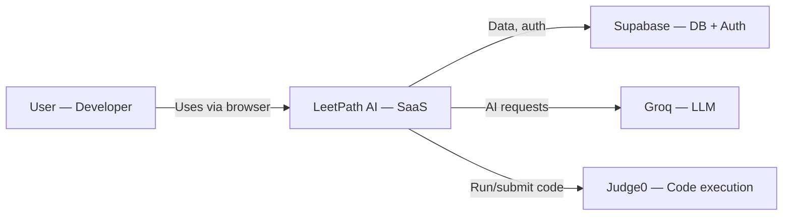
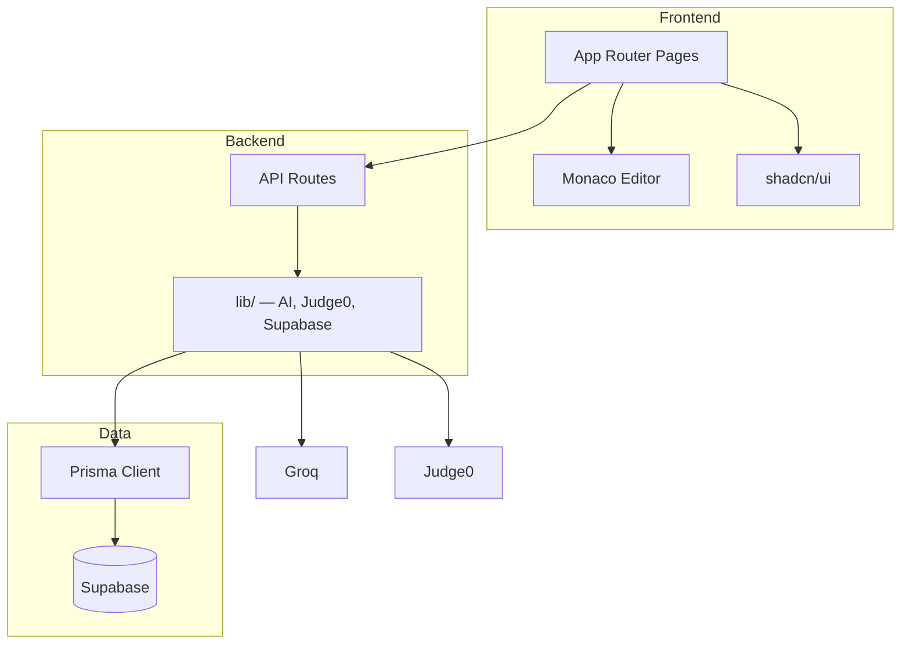

# LeetPath AI — Diagrams Reference

Standalone Mermaid diagrams for architecture and flows. See [system-design.md](./system-design.md) for full context.

---

## System Context (Users & External Systems)



---

## Component Overview (Simplified)



---

## Question Generation → Workspace → Score (End-to-End)

```mermaid
flowchart LR
    A[User profile + stats] --> B[POST /api/questions]
    B --> C[Groq: generate question]
    C --> D[Save question / return]
    D --> E[Practice workspace]
    E --> F[User writes code]
    F --> G[POST /api/execute]
    G --> H[Judge0]
    H --> I[Test results]
    I --> J[POST /api/score]
    J --> K[Groq: score + feedback]
    K --> L[Save Score, show to user]
```



---

## File Layout (Docs)

```
docs/
├── README.md          # Index and quick links
├── system-design.md   # Full high-level design + embedded diagrams
└── diagrams.md        # Standalone diagram reference (this file)
```
