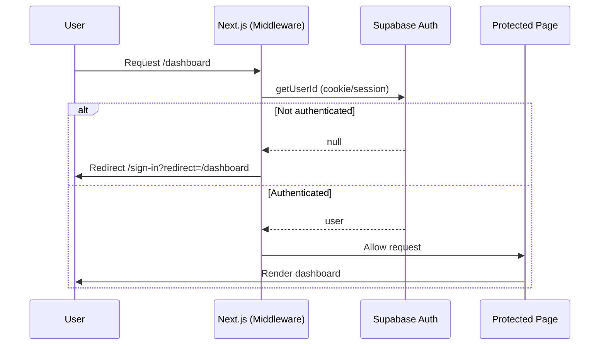
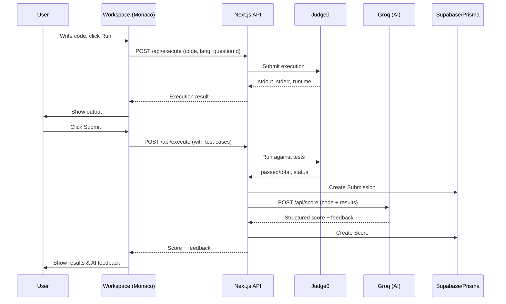
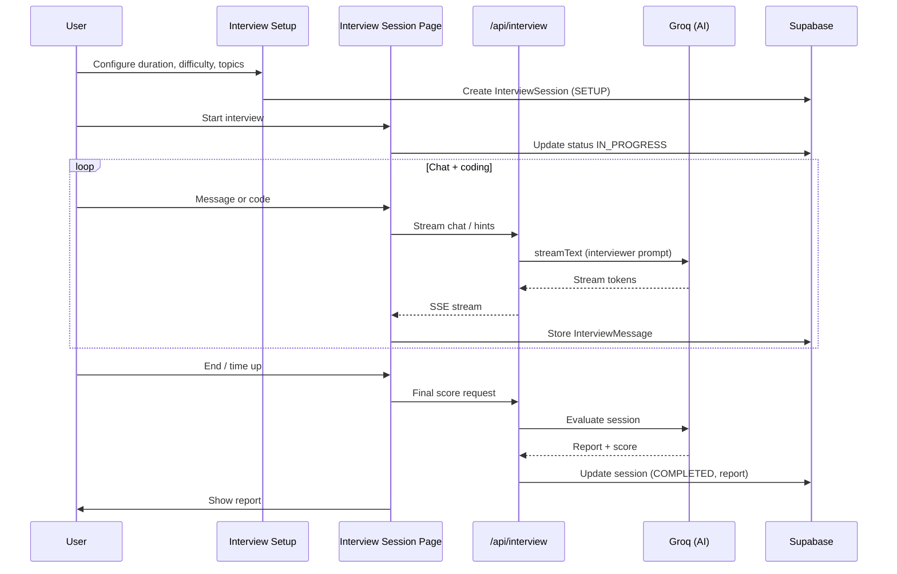
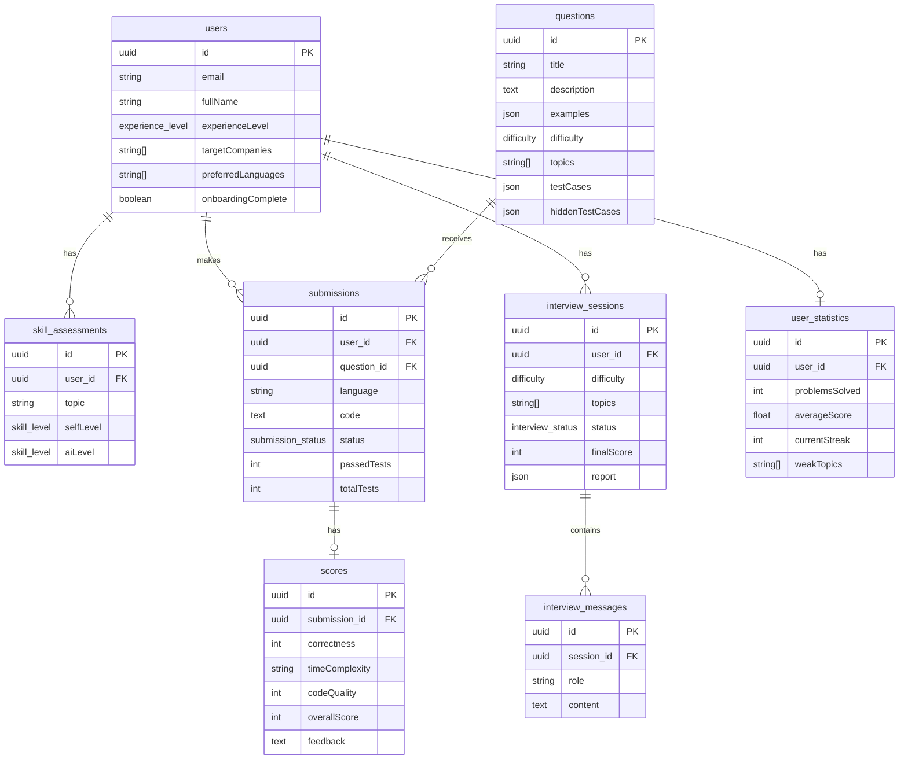
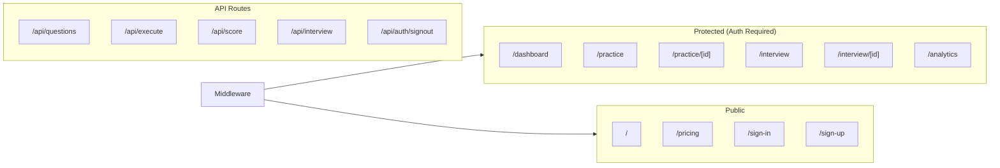
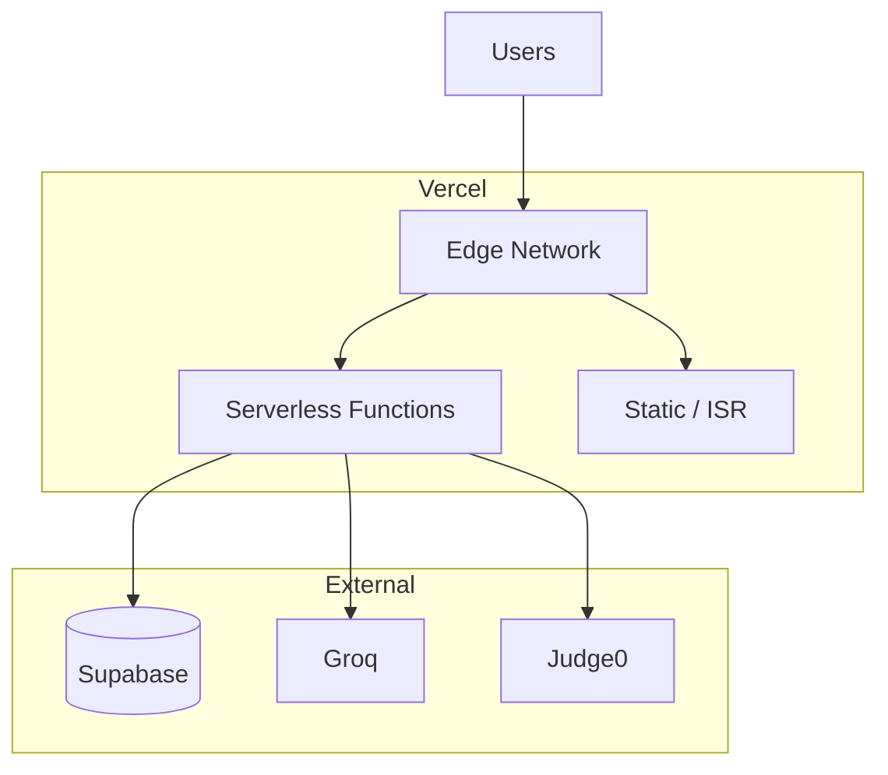

# LeetPath AI — High-Level System Design

Technical interview prep SaaS: AI-generated questions, coding workspace with execution, AI code scoring, and simulated interviews.

---

## 1. Overview

| Aspect | Description |
|--------|-------------|
| **Product** | LeetPath AI — SaaS for technical interview preparation |
| **Core value** | AI question generation, real-time code execution, AI code scoring, and interview simulation |
| **Deployment** | Vercel (free tier) |
| **Database** | PostgreSQL via Supabase |
| **Auth** | Supabase Auth (email + social) |

---

## 2. Architecture Diagram

```mermaid
graph TB
    subgraph client["Client (Browser)"]
        Landing[Landing / Marketing]
        Auth[Sign In / Sign Up]
        Dashboard[Dashboard]
        Practice[Practice — Question Bank & Workspace]
        Interview[Interview Sim]
        Analytics[Analytics]
    end

    subgraph next["Next.js App (Vercel)"]
        API[API Routes]
        SSR[Server Components / Pages]
    end

    subgraph api_routes["API Layer"]
        QGen[/api/questions]
        Execute[/api/execute]
        Score[/api/score]
        InterviewAPI[/api/interview]
        SignOut[/api/auth/signout]
    end

    subgraph external["External Services"]
        Supabase[(Supabase — DB + Auth)]
        Groq[Groq — Llama 3.3]
        Judge0[Judge0 — Code Execution]
    end

    Landing --> SSR
    Auth --> Supabase
    Dashboard --> API
    Practice --> QGen
    Practice --> Execute
    Practice --> Score
    Interview --> InterviewAPI
    Interview --> Execute
    Interview --> Score
    Analytics --> API

    QGen --> Groq
    Score --> Groq
    InterviewAPI --> Groq
    Execute --> Judge0
    API --> Supabase
```

---

## 3. Tech Stack

| Layer | Technology | Purpose |
|-------|------------|---------|
| **Framework** | Next.js 15 (App Router) | Full-stack, SSR, API routes, Vercel-native |
| **Database** | PostgreSQL (Supabase) | Users, questions, submissions, scores, sessions |
| **ORM** | Prisma | Type-safe DB access, migrations |
| **Auth** | Supabase Auth | Email + Google/GitHub, JWT sessions |
| **AI** | Vercel AI SDK + Groq (Llama 3.3) | Question generation, code scoring, interviewer chat |
| **Code execution** | Judge0 (RapidAPI) | Run/submit code, 40+ languages |
| **Editor** | Monaco (@monaco-editor/react) | In-browser code editing |
| **UI** | Tailwind v4 + shadcn/ui | Styling and components |

---

## 4. Request & Data Flow

### 4.1 Authentication Flow



### 4.2 Practice Flow (Run Code → Submit → Score)



### 4.3 Interview Simulation Flow



---

## 5. Data Model (Entity Relationship)



---

## 6. Application Structure (Routes)



- **Middleware** refreshes Supabase session and redirects unauthenticated users from `/dashboard`, `/practice`, `/interview`, `/analytics` to `/sign-in`.
- **Auth routes** (`/sign-in`, `/sign-up`): redirect authenticated users to `/dashboard`.

---

## 7. External Integrations

| Service | Usage | Config |
|---------|--------|--------|
| **Supabase** | Auth (JWT, cookies), PostgreSQL | `NEXT_PUBLIC_SUPABASE_URL`, `NEXT_PUBLIC_SUPABASE_ANON_KEY`, `SUPABASE_SERVICE_ROLE_KEY` |
| **Groq** | Question generation, code scoring, interviewer chat | `GROQ_API_KEY` |
| **Judge0** | Code run/submit | `JUDGE0_API_KEY`, `JUDGE0_API_URL` |

---

## 8. Deployment (Vercel)



- **Next.js** is deployed as a Vercel project; API routes run as serverless functions.
- **Env vars** (Supabase, Groq, Judge0, `NEXT_PUBLIC_APP_URL`) are set in Vercel.
- **Database** lives in Supabase; Prisma migrations are run outside Vercel (e.g. CI or local).

---

## 9. Security Considerations

- **Auth**: All protected routes validated by middleware via Supabase session; no server-side role key on client.
- **API**: Question, execute, score, and interview routes should resolve the current user from Supabase (server) and scope data by `userId` / `sessionId`.
- **Secrets**: `GROQ_API_KEY`, `JUDGE0_*`, `SUPABASE_SERVICE_ROLE_KEY` only in server env; never exposed to client.
- **Rate limits**: Consider Vercel rate limiting or upstream (Groq/Judge0) limits for abuse control.

---

## 10. Diagram Index

| Diagram | Section | Description |
|---------|---------|-------------|
| Architecture | §2 | High-level boxes: Client, Next.js, API routes, external services |
| Auth flow | §4.1 | Sequence: request → middleware → Supabase → redirect or allow |
| Practice flow | §4.2 | Sequence: run/submit → execute → score → DB |
| Interview flow | §4.3 | Sequence: setup → session → chat/code → report |
| Data model | §5 | ER diagram: users, questions, submissions, scores, interviews, stats |
| Routes | §6 | Public vs protected routes and API routes |
| Deployment | §8 | Vercel → serverless + external services |

All diagrams are in Mermaid and render in GitHub, VS Code (with Mermaid support), and most modern Markdown viewers.
